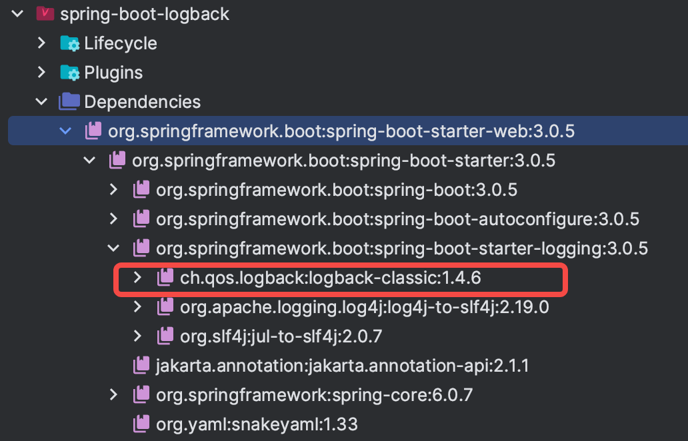

# Spring Boot 3.0 - 日志记录 Logback（2）

在 Spring Boot 中，日志是一项重要的功能，用于记录应用程序运行时的信息，包括调试信息、错误信息等。Spring Boot 内置了多种日志框架，其中 Logback 是默认的日志框架，并且在很多生产环境中广泛使用。本篇博客将介绍如何在 Spring Boot 中使用 Logback 进行日志记录和配置。

## 什么是 Logback

Logback 是一款基于 Java 的开源日志框架，由 Ceki Gülcü 创建，是 log4j 的后继者。它提供了灵活且高效的日志记录和配置功能，可以帮助开发者在应用程序中记录和管理日志信息。

Logback 支持多种日志级别，包括 TRACE、DEBUG、INFO、WARN 和 ERROR，可以根据需求设置不同级别的日志记录。此外，Logback 还支持异步日志记录，可以提高应用程序的性能。

## 什么是 SLF4J

`SLF4J（Simple Logging Facade for Java）` 是一个日志框架的门面（facade）或抽象层，用于在 Java 应用程序中进行日志记录。它提供了一种简单且统一的日志记录接口，可以在运行时选择不同的日志实现库进行实际的日志记录操作。

Logback 则是一个实现了 SLF4J 接口的日志实现库，它提供了一套灵活且高性能的日志记录组件，包括了日志框架（Logger）、日志输出器（Appender）、日志滚动策略（Rolling Policy）等组件，用于实现在 Java 应用程序中的日志记录。

因此，SLF4J 是一个抽象层，提供了一种统一的日志接口，而 Logback 则是 SLF4J 的一个实现库，提供了实际的日志记录功能。使用 SLF4J 和 Logback 的组合，可以在 Java 应用程序中实现灵活且高性能的日志记录，同时允许在运行时切换不同的日志实现库，方便地适应不同的日志记录需求和场景。

## 如何在 Spring Boot 中使用 Logback

在 Spring Boot 中，Logback 默认作为日志框架，无需额外的配置即可使用。Spring Boot 使用 Logback 作为默认日志框架，是因为 Logback 具有良好的性能和丰富的功能。

下面是在 Spring Boot 中使用 Logback 的步骤：

### 步骤1：添加 Logback 依赖

首先，在项目的 Maven 或 Gradle 配置文件中，添加 Logback 依赖。例如，在 Maven 中，可以在 pom.xml 文件中添加以下依赖：

```xml
<dependencies>
    <!-- 添加 Logback 依赖 -->
    <dependency>
        <groupId>ch.qos.logback</groupId>
        <artifactId>logback-classic</artifactId>
    </dependency>
</dependencies>
```
> 需要注意的是，如果项目中已经添加了 `spring-boot-starter` 或者 `spring-boot-starter-web` 依赖，是不需要再单独添加 `Logback` 依赖的，因为这两个依赖中已经默认集成了 `Logback`。



### 步骤2：配置 Logback（重点）

在 Spring Boot 中，可以通过在 `src/main/resources` 目录下创建 `logback-spring.xml` 文件来配置 Logback。Spring Boot 会自动加载该配置文件，并将其作为日志框架的配置。

以下是一个完整的可用于**生产环境**的 Logback 配置示例：

```xml
<?xml version="1.0" encoding="UTF-8" ?>
<configuration debug="false" scan="true" scanPeriod="60 seconds">
    <!-- 第一部分：参数配置 -->
    <!-- 日志存储路径 -->
    <property name="LOG_HOME" value="./logs"/>
    <!-- 输出到控制台的日志的输出格式（输出结果带有颜色） -->
    <property name="LOG_CONSOLE_PATTERN" value="%d{yyyy-MM-dd HH:mm:ss.SSS} %highlight(%-5level) %yellow(%X{traceId}) [%yellow(%thread)] %green(%40.40logger{40}) %highlight(%class{0}:%line): %msg%n"/>
    <!-- 输出到文件中的日志的输出格式 -->
    <property name="LOG_FILE_PATTERN" value="%d{yyyy-MM-dd HH:mm:ss.SSS} %-5level %X{traceId} [%thread] %40.40logger{40} %class{0}:%line: %msg%n"/>

    <!-- 第二部分：日志输出策略 -->
    <!-- 文件输出：全日志输出策略 - 包含全部日志 -->
    <appender name="DailyFile" class="ch.qos.logback.core.rolling.RollingFileAppender">
        <file>${LOG_HOME}/common.log</file>
        <rollingPolicy class="ch.qos.logback.core.rolling.SizeAndTimeBasedRollingPolicy">
            <!-- 日志分片后的日志名（按时间及大小分） -->
            <FileNamePattern>${LOG_HOME}/common.%d{yyyy.MM.dd}-%i.log</FileNamePattern>
            <!-- 单个日志文件大小 -->
            <MaxFileSize>100MB</MaxFileSize>
            <!-- 日志文件保留天数 - 自动清除老的日志文件，防止磁盘爆满 -->
            <MaxHistory>30</MaxHistory>
        </rollingPolicy>
        <encoder class="ch.qos.logback.classic.encoder.PatternLayoutEncoder">
            <!-- 日志输出格式 -->
            <pattern>${LOG_FILE_PATTERN}</pattern>
        </encoder>
    </appender>

    <!-- 文件输出：异常日志输出策略 - 仅包含 error 级别的日志 -->
    <appender name="ErrorFile" class="ch.qos.logback.core.rolling.RollingFileAppender">
        <file>${LOG_HOME}/error.log</file>
        <filter class="ch.qos.logback.classic.filter.ThresholdFilter">
            <level>ERROR</level>
        </filter>
        <rollingPolicy class="ch.qos.logback.core.rolling.SizeAndTimeBasedRollingPolicy">
            <FileNamePattern>${LOG_HOME}/error.%d{yyyy.MM.dd}-%i.log</FileNamePattern>
            <MaxFileSize>100MB</MaxFileSize>
            <MaxHistory>30</MaxHistory>
        </rollingPolicy>
        <encoder class="ch.qos.logback.classic.encoder.PatternLayoutEncoder">
            <pattern>${LOG_FILE_PATTERN}</pattern>
        </encoder>
    </appender>

    <!-- 控制台输出日志：包含全部日志 -->
    <appender name="Console" class="ch.qos.logback.core.ConsoleAppender">
        <encoder class="ch.qos.logback.classic.encoder.PatternLayoutEncoder">
            <pattern>${LOG_CONSOLE_PATTERN}</pattern>
        </encoder>
    </appender>

    <!-- 第三部分：根输出器（Root Logger）配置 -->
    <!-- 同时输出三种策略的日志 -->
    <root level="info">
        <appender-ref ref="DailyFile"/>
        <appender-ref ref="ErrorFile"/>
        <appender-ref ref="Console"/>
    </root>
</configuration>
```
从上面的配置可以看出，其主要分为了三个部分。

1. 参数配置

* `<configuration debug="false" scan="true" scanPeriod="60 seconds">`
  * `debug="false"`: 表示是否开启调试模式，此处设置为false，即关闭调试模式。
  * `scan="true"`: 表示是否开启配置文件的扫描功能，此处设置为true，即开启扫描功能。Logback 会定期扫描当前配置文件（即包含这个 `<configuration>` 节点的文件）是否有修改。如果有修改，Logback 会自动重新加载配置，以应用新的配置。这样可以在运行时动态修改日志的配置，而不需要重启应用程序。
  * `scanPeriod="60 seconds"`: 表示配置文件扫描的时间间隔，此处设置为60秒。

* `property` 参数配置
  * `LOG_HOME`: 表示日志文件在操作系统中存储时的文件路径。
  * `LOG_CONSOLE_PATTERN`: 表示日志输出到控制台时的输出格式，一般会对不同的输出内容设置不同的颜色以方便查看。
  * `LOG_FILE_PATTERN`: 表示日志输出到文件时的输出格式。

其中需要着重说明的是，日志输出格式：`%d{yyyy-MM-dd HH:mm:ss.SSS} %-5level %X{traceId} [%thread] %40.40logger{40} %class{0}:%line: %msg%n`

* `%d{yyyy-MM-dd HH:mm:ss.SSS}`: 表示输出日志的时间，格式为 `yyyy-MM-dd HH:mm:ss.SSS`。
* `%-5level`: 输出日志的级别，左对齐，最多占用5个字符的宽度。
* `%X{traceId}`: 输出 MDC 中的名为 `traceId` 的值。前提是在代码中通过 `MDC.put("traceId", traceId)` 将 traceId 存储到 MDC 中。
* `[%thread]`: 输出日志的线程名。
* `%40.40logger{40}`: 输出日志记录器的名称，最多占用40个字符的宽度。
* `%class{0}:%line`: 输出日志的类名和行号，用于定位该条日志是在哪儿产生的。
* `%msg%n`: 输出日志的具体内容和换行符。

2. 日志输出策略

日志输出策略一般会设置三种。

* 控制台输出：方便日常开发调试用。
* 文件输出（全日志）：记录全部的日志，一般包含 `INFO`，`DEBUG`，`WARN`， `ERROR` 等级别的日志。
* 文件输出（异常日志）：仅记录 `ERROR` 级别的日志，方便快速查看项目出现的异常报错。

文件输出策略中，一般是需要配置输出规则的。

* `<file>`: 配置日志输出的文件路径和文件名，`${LOG_HOME}` 是应用了参数配置中的变量。
* `<filter>`: 配置日志过滤器，用于对日志进行筛选。在这里使用了 `ThresholdFilter`，该过滤器设置了只接收 `ERROR` 级别及以上的日志。
* `<rollingPolicy>`: 配置滚动策略，用于控制日志文件的滚动方式。这里使用了 `SizeAndTimeBasedRollingPolicy`，该策略基于文件大小和时间进行日志滚动。
  * `<FileNamePattern>`: 配置滚动后生成的文件名模式，`%d{yyyy.MM.dd}` 表示日期，`%i` 表示滚动文件的索引。
  * `<MaxFileSize>`: 配置单个日志文件的最大大小，当日志文件达到该大小时将触发滚动。
  * `<MaxHistory>`: 配置保留的日志文件的最大数量，超过这个数量的日志文件将被删除。因为此处设置是每天进行滚动，所以该配置的含义为保留日志文件的最大天数。
* `<encoder>`: 配置日志的编码器，用于将日志输出的格式进行编码。通过 `${LOG_FILE_PATTERN}` 引用了一个参数配置中的变量。

3. 根输出器配置

这段配置的作用是将日志同时输出到文件和控制台，且只输出 `info` 级别及以上的日志信息，并将 `ERROR` 级别的日志单独输出到指定文件中。

### 步骤3：使用 Logback 进行日志记录

在 Spring Boot 中，可以通过使用 slf4j 提供的 Logger 类来进行日志记录。可以通过依赖注入的方式获取 Logger 对象，并在代码中使用它来记录不同级别的日志。

```java
import org.slf4j.Logger;
import org.slf4j.LoggerFactory;

public class MyService {
    
    private static final Logger LOGGER = LoggerFactory.getLogger(MyService.class);

    public void doSomething() {
        LOGGER.debug("Debug log");
        LOGGER.info("Info log");
        LOGGER.warn("Warn log");
        LOGGER.error("Error log");
    }
}
```
除此之外，我们还可以使用 lombok 的注解来更方便的实现日志记录。个人更喜欢这种方式，更加的简洁方便。但某些公司可能因为某些原因禁止使用 lombok，那么可以选用第一种方式。

```java
import lombok.extern.slf4j.Slf4j;

@Slf4j
public class MyService {
    public void doSomething() {
        log.debug("Debug log");
        log.info("Info log");
        log.warn("Warn log");
        log.error("Error log");
    }
}
```

## TraceId（重点）

在分布式系统中，跨多个微服务的请求链路上进行日志记录和跟踪变得非常重要。`Trace ID` 是一种在请求链路中唯一标识请求的方式，它可以用于在不同的服务之间传递和记录请求的相关信息，以便在日志中进行追踪和调试。

在 Spring Boot 应用程序中，我们可以通过使用 Logback 作为日志框架，结合 `MDC（Mapped Diagnostic Context）` 功能来实现 Trace ID 的自动传递和记录。

### 什么是 MDC

MDC 主要用于在多线程和分布式环境中，在日志记录过程中传递和管理上下文信息，例如请求ID、用户ID、会话ID等。MDC使用一个线程本地的 Map 结构来存储这些上下文信息，每个线程都有自己独立的 MDC 实例，不同线程之间的 MDC 信息互不干扰。

### 添加 Trace ID

在 Spring Boot 项目中，我们可以优先从接口请求的 Header 中查看是否已经包含了 TraceId，如果已经包含了的话，则需要将其传递下去，如果没有包含的话，则需要生成一个新的。一般我们会使用拦截器来实现。

```java
public class TraceIdInterceptor implements HandlerInterceptor {
    @Override
    public boolean preHandle(@NonNull HttpServletRequest request, @NonNull HttpServletResponse response, @NonNull Object handler) throws Exception {
        // 从请求头中获取 traceId
        String traceId = request.getHeader(LogConstants.HEADER_TRACE_ID);
        if (StringUtils.isBlank(traceId)) {
            // 如果 traceId 不存在则生成一个新的 traceId
            traceId = TraceIdUtils.getTraceId();
        }
        // 将 traceId 设置到响应头中
        response.setHeader(LogConstants.HEADER_TRACE_ID, traceId);
        // 将 traceId 设置到 MDC 中
        MDC.put(LogConstants.MDC_TRACE_ID, traceId);
        return HandlerInterceptor.super.preHandle(request, response, handler);
    }

    @Override
    public void afterCompletion(@NonNull HttpServletRequest request, @NonNull HttpServletResponse response, @NonNull Object handler, Exception ex) throws Exception {
        // 接口返回时，清除 MDC 中的 traceId
        MDC.remove(LogConstants.MDC_TRACE_ID);
        HandlerInterceptor.super.afterCompletion(request, response, handler, ex);
    }
}
```

### Trace ID 的跨线程传递

因为 MDC 是线程间隔离的，所以如果不做处理，在接收请求后，额外创建子线程，并在子线程中打印日志，是不会包含 Trace ID 信息的。如下方代码，第二条日志是不会包含 Trace ID 的：

```java
@Slf4j
public class MyService {
    public void doSomething() {
        log.info("包含 trace id 的消息");
        new Thread(() -> log.info("子线程不包含 trace id 的消息")).start();
    }
}
```
要解决 Trace ID 在线程间的透传问题，其核心在于对 `Runnable` 及 `Callable` 做一个包装，以接收上游线程传递的 MDC 上下文。代码如下：

```java
public class TraceIdUtils {
    public static void setTraceIdIfAbsent() {
        if (StringUtils.isBlank(MDC.get(MDC_TRACE_ID))) {
            setTraceId(null);
        }
    }

    /**
     * Callable 任务包装
     *
     * @param callable callable 任务
     * @param context  MDC 上下文 Map - MDC.getCopyOfContextMap()
     * @param <T>      callable 返回数据的范型
     * @return 包装后的 callable 任务
     */
    public static <T> Callable<T> wrap(final Callable<T> callable, final Map<String, String> context) {
        return () -> {
            if (context == null) {
                MDC.clear();
            } else {
                MDC.setContextMap(context);
            }
            setTraceIdIfAbsent();
            T var;
            try {
                var = callable.call();
            } finally {
                MDC.clear();
            }
            return var;
        };
    }

    /**
     * runnable 任务包装
     *
     * @param runnable runnable 任务
     * @param context  MDC 上下文 Map - MDC.getCopyOfContextMap()
     * @return 包装后的 runnable 任务
     */
    public static Runnable wrap(final Runnable runnable, final Map<String, String> context) {
        return () -> {
            if (context == null) {
                MDC.clear();
            } else {
                MDC.setContextMap(context);
            }
            setTraceIdIfAbsent();
            try {
                runnable.run();
            } finally {
                MDC.clear();
            }
        };
    }
}
```
使用起来也很简单，如下代码：

```java
@Slf4j
public class MyService {
    public void doSomething() {
        log.info("包含 trace id 的消息");
        new Thread(() -> log.info("子线程不包含 trace id 的消息")).start();
        // 使用 TraceIdUtils.wrap() 将 MDC 上下文传递到下去
        new Thread(TraceIdUtils.wrap(() -> log.info("子线程包含了 trace id 的消息"), MDC.getCopyOfContextMap())).start();
    }
}
```

### Trace ID 通过线程池传递

在实际项目中，我们是不推荐甚至禁止 `new Thread()` 这种形式来创建子线程，推荐做法是使用线程池来实现。然而通过线程池创建子线程并传递 Trace ID 的原理与上面是一样的。

首先要先实现 `TaskDecorator` 接口，它的作用是在运行任务（Runnable）之前，保存当前线程的 MDC 上下文，并在任务执行完毕后清除 MDC 上下文，以确保在多线程环境下，MDC 上下文的正确传递和清理。

```java
public class TraceIdTaskDecorator implements TaskDecorator {
    @NonNull
    @Override
    public Runnable decorate(@NonNull Runnable runnable) {
        Map<String, String> contextMap = MDC.getCopyOfContextMap();
        return () -> {
            if (contextMap != null) {
                MDC.setContextMap(contextMap);
            }
            try {
                runnable.run();
            } finally {
                MDC.clear();
            }
        };
    }
}
```

然后需要自定义线程池代替 Spring 默认的线程池，这样我们就可以使用 `@Async` 注解进行异步调用。自定义线程池代码如下：

```java
@Slf4j
@Component
public class CustomAsyncConfigurer implements AsyncConfigurer {

    @Override
    public Executor getAsyncExecutor() {
        ThreadPoolTaskExecutor executor = new ThreadPoolTaskExecutor();
        executor.setCorePoolSize(8);
        executor.setMaxPoolSize(16);
        executor.setQueueCapacity(100);
        executor.setThreadNamePrefix("async-pool-");
        executor.setTaskDecorator(new TraceIdTaskDecorator());
        executor.setWaitForTasksToCompleteOnShutdown(true);
        executor.initialize();
        return executor;
    }

    @Override
    public AsyncUncaughtExceptionHandler getAsyncUncaughtExceptionHandler() {
        return (ex, method, params) -> log.error("async execute error, method: {}, param: {}", method.getName(), Arrays.toString(params), ex);
    }
}
```
由上述代码可以发现，上一步自定义的 `TraceIdTaskDecorator` 传入了该线程池，以实现 `TraceId` 的透传。

其他自定义线程池的方式见 `ForkJoinPoolMdcWrapper`，`ThreadPoolTaskExecutorMdcWrapper`，`ThreadPoolExecutorMdcWrapper` 封装。如下示例：

```java
@Slf4j
@Service
public class LogbackService {
    public void threadPoolLog() {
        // 自定义线程池
        ThreadPoolExecutor threadPoolExecutor = new ThreadPoolExecutorMdcWrapper(8, 16, 1000, TimeUnit.MILLISECONDS, new ArrayBlockingQueue<>(100));
        threadPoolExecutor.execute(() -> log.info("使用线程池 ThreadPoolExecutor 开启的子线程，日志信息包含 TraceID"));
        threadPoolExecutor.submit(() -> log.info("使用线程池 ThreadPoolExecutor 开启的子线程，日志信息包含 TraceID"));
    }
}
```

### Trace Id 在网络上的传递（HTTP、RPC）

因为情况较多，而处理方式大同小异，所以此处仅列举最常见的 `openfeign` 组件的配置方式。添加如下拦截器：

```java
public class FeignInterceptor implements RequestInterceptor {
    @Override
    public void apply(RequestTemplate template) {
        template.header(TraceIdUtils.HEADER_TRACE_ID, TraceIdUtils.getTraceId());
    }
}
```
然后在 `FeignClient` 接口定义中添加此配置即可。

```java
@FeignClient(name = "default", url = "https://blog.junmoyu.com", path = "/api", configuration = FeignInterceptor.class)
public interface FeignService {
}
```

## 总结

Logback 是 Spring Boot 默认的日志框架，提供了灵活且高效的日志记录和配置功能。通过简单的配置，可以在 Spring Boot 中使用 Logback 进行日志记录，并根据实际需求进行高级配置。在本篇博客中，我们介绍了在 Spring Boot 中使用 Logback 的基本步骤：

1. 添加 Logback 依赖：在 Maven 或 Gradle 中添加 Logback 的依赖，Spring Boot 默认已经包含了 Logback 相关的依赖，无需额外添加。
2. 创建 Logback 配置文件：在 `src/main/resources` 目录下创建一个名为 `logback-spring.xml` 的 Logback 配置文件，并在文件中定义日志的输出格式、级别和输出目标。
3. 使用 Logback 进行日志记录：在代码中通过 `LoggerFactory.getLogger()` 方法获取 Logger 对象，然后使用 `Logger` 对象记录不同级别的日志。
4. 另外还了解了如何在日志中添加 Trace ID 来更好的进行日志跟踪，以及如何解决线程间和服务间的 Trace ID 透传。

同时，我们还介绍了 Logback 的一些高级配置选项，例如日志滚动策略、异步日志记录和日志过滤器，以便进一步定制日志记录行为。

希望这篇博客能够帮助你了解 Spring Boot 中 Logback 的基本使用和配置方法，并在实际项目中能够灵活应用 Logback 进行日志记录和管理。如有疑问或需要进一步了解，可以参考 Logback 官方文档和示例，或查阅其他相关资料。