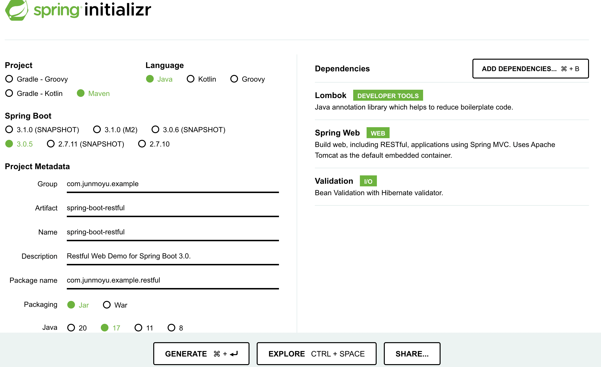
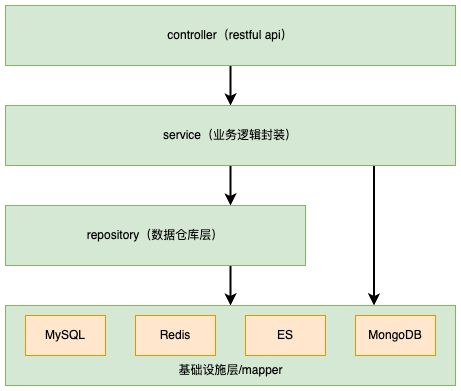
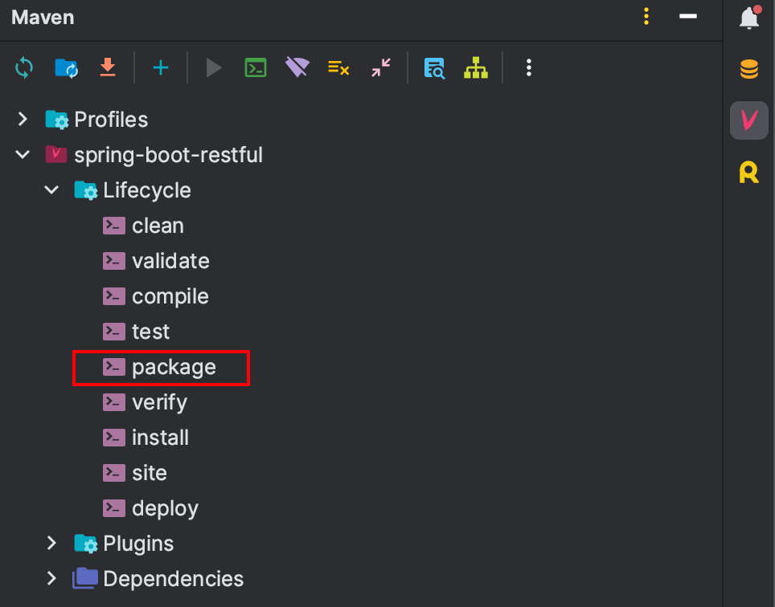
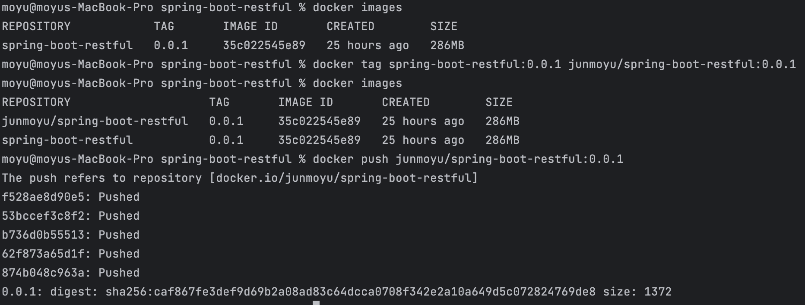
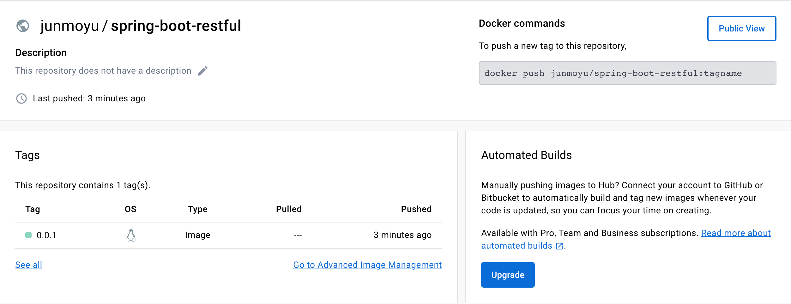

# Spring Boot 3.0 - Restful Web 服务（1）

本教程将介绍如何基于 Spring Boot 3.0 开发构建一个基础但完整的 Restful Web 服务。 其中包含以下内容：

* 项目创建与依赖
* 工程架构
* 多环境配置
* 统一响应数据结构
* 全局异常捕获处理
* Restful 接口定义与开发
* 参数校验
* 运行部署

> 本文旨在用最少的内容展示一个基础但完整的 Spring Boot 应用要如何从零到一，从开发到实际部署的过程。所以内容较多但不深，对于其中一些重要内容，后续会单独拎出来详细说明。同时对一些未涉及到的内容会继续补充完整，尽情期待。


## 项目创建与依赖

### 项目创建

可以使用 [Spring Initializer](https://start.spring.io) 创建一个新的 Spring Boot 项目，选择相应的依赖即可。



如上图所示，配置好，选择完相关依赖后点击 `GENERATE` 生成即可下载，解压之后可使用 IDE 编辑器打开。

或者也可以按照下方的目录结构手动创建也可以。
```
├── src             # 源代码目录
│ ├── main          # 主代码目录
│ │ ├── java        # Java 文件目录
│ │ └── resources   # 资源 & 配置文件目录
│ └── test          # 测试代码目录
│   └── java        # 测试 Java 文件目录
└── pom.xml         # Maven 依赖配置文件
```
> 推荐使用 [Spring Initializer](https://start.spring.io) 进行项目创建。

### 项目依赖

最基础的依赖配置如下所示：
```xml
<?xml version="1.0" encoding="UTF-8"?>
<project xmlns="http://maven.apache.org/POM/4.0.0" xmlns:xsi="http://www.w3.org/2001/XMLSchema-instance"
         xsi:schemaLocation="http://maven.apache.org/POM/4.0.0 https://maven.apache.org/xsd/maven-4.0.0.xsd">
    <modelVersion>4.0.0</modelVersion>
    <parent>
        <groupId>org.springframework.boot</groupId>
        <artifactId>spring-boot-starter-parent</artifactId>
        <version>3.0.5</version>
    </parent>
    
    <groupId>com.junmoyu.example</groupId>
    <artifactId>spring-boot-restful</artifactId>
    <version>0.0.1-SNAPSHOT</version>

    <name>spring-boot-restful</name>
    
    <dependencies>
        <dependency>
            <groupId>org.springframework.boot</groupId>
            <artifactId>spring-boot-starter-web</artifactId>
        </dependency>
        <dependency>
            <groupId>org.projectlombok</groupId>
            <artifactId>lombok</artifactId>
            <optional>true</optional>
        </dependency>
    </dependencies>
</project>
```

如果要添加其他功能，则需要在 `dependencies` 节点下添加相关的依赖。如要使用参数校验功能，则需要添加如下依赖配置：
```xml
<dependency>
    <groupId>org.springframework.boot</groupId>
    <artifactId>spring-boot-starter-validation</artifactId>
</dependency>
```

如需添加数据源相关，则添加如下依赖配置：
```xml
<dependency>
    <groupId>org.mybatis.spring.boot</groupId>
    <artifactId>mybatis-spring-boot-starter</artifactId>
    <version>3.0.1</version>
</dependency>

<!-- 为方便演示，此处使用H2，正常项目请使用 MySQL 或 PostgreSQL 等 -->
<dependency>
    <groupId>com.h2database</groupId>
    <artifactId>h2</artifactId>
    <scope>runtime</scope>
</dependency>
```

## 工程架构

本项目的工程架构如下图所示：



### Controller - 接口层

接口层仅包含接口定义，参数校验，权限认证，不包含具体的业务逻辑。

```java
@RestController
@RequestMapping("articles")
@RequiredArgsConstructor
public class ArticleController {

    private final ArticleService articleService;

    @GetMapping("")
    public Response<PageResult<ArticleResponse>> listArticle(ArticlePageRequest pageRequest) {
        return Response.success(articleService.listArticle(pageRequest));
    }

    @GetMapping("{id}")
    public Response<ArticleResponse> getArticle(@PathVariable Long id) {
        return Response.success(articleService.getArticleDetail(id));
    }
    
    @PostMapping()
    public Response<Long> createArticle(@RequestBody @Valid ArticleCreateRequest createRequest) {
        return Response.success(articleService.createArticle(createRequest));
    }
    
    @PutMapping("{id}")
    public Response<Boolean> updateArticle(@PathVariable Long id, @RequestBody @Valid ArticleUpdateRequest updateRequest) {
        updateRequest.setId(id);
        articleService.updateArticle(updateRequest);
        return Response.success(true);
    }
    
    @DeleteMapping("{id}")
    public Response<Boolean> deleteArticle(@PathVariable Long id) {
        articleService.deleteArticle(id);
        return Response.success(true);
    }
}
```

### Service - 业务层

业务层，主要用来实现具体的业务逻辑，通常需要操作多个实体数据，并将多个实体的数据拆分组合成最终的接口响应数据。

```java
@Service
@RequiredArgsConstructor
public class ArticleService {
    private final ArticleRepository articleRepository;
    private final CommentRepository commentRepository;
    
    public ArticleResponse getArticleDetail(Long articleId) {
        // 获取文章信息
        ArticleEntity article = articleRepository.getArticle(articleId);
        if (article == null) {
            throw new RuntimeException("文章不存在");
        }
        // 获取评论信息
        List<String> comments = commentRepository.listCommentContent(articleId);
        // 组合多个实体数据并返回响应数据
        return ArticleResponse.builder()
                .id(article.getId())
                .name(article.getName())
                .author(article.getAuthor())
                .content(article.getContent())
                .comments(comments)
                .build();
    }
}
```

在传统的编码中，一般我们会先定义一个 `public interface ArticleService {}` 的接口，然后编写该接口的实现类 `public class ArticleServiceImpl implements ArticleService {}`。

然而个人认为此处定义接口的意义并不大，实际开发中基本都是一对一的实现，所以在我的工程结构中去除了类似的接口定义，个人觉得代码更简洁明了一些。

### Repository - 数据层

数据层的主要作用是用来解耦 Service 业务层与底层异构数据源之间的关联，Service 层不关心数据的存储问题。

* 场景一：将多个异构数据源中的数据取出并组装返回，如文章的基本信息存储在 MySQL 中，文本内容存储在 MongoDB 中，文章点赞收藏数据存储在 Redis 中。
* 场景二：同一个数据因业务升级，更换数据源，如文章的文本内容从 MySQL 存储换成 MongoDB/ElasticSearch 存储以提升性能，可以放在 Repository 中处理。
* 场景三：为提升性能，为数据添加缓存，可以在此层处理。

Repository 层一般负责单个实体的数据处理，一般只是单纯的数据增删改查，缓存，尽可能不要涉及业务。

Service 层主要负责实际的业务逻辑，一般是单个或多个实体的操作。

```java
@Repository
@RequiredArgsConstructor
public class ArticleRepository {
    private final ArticleMapper articleMapper;

    public Long createArticle(ArticleEntity articleEntity) {
        // 封装部分需要系统生成或处理的数据
        articleEntity.setCreateTime(new Date());
        articleEntity.setUpdateTime(new Date());
        if (articleMapper.insert(articleEntity) > 0) {
            // 如果需要将文章的文本内容存储到 MongoDB 中，可以在 Repository 层中实现
            return articleEntity.getId();
        }
        throw new RuntimeException("文章创建失败");
    }
}
```

### 基础设施层

基础设施层包含组件配置、常量设置、全局异常捕获处理、工具类、数据源、第三方 HTTP API 调用等等。

本项目中的 `com.junmoyu.example.restful.infrastructure` 包就是主要的基础设施层的代码，其中可以包含配置、常量、异常、工具等。

另外 `com.junmoyu.example.restful.repository.mapper` 包里面数据源相关的 mapper 可以将其归类于 Repository 也可以归类于基础设施层。

## 多环境配置

Spring Boot 的配置文件在 `src/main/resources` 目录下创建，有 `.properties` 与 `.yaml` 两种格式，建议使用 `.yaml` 格式，结构更清晰。

Spring Boot 支持使用多个配置文件来管理不同环境下的配置。在 Spring Boot 中，可以通过在配置文件名中添加特定的后缀来指定不同的环境，例如：

* application.yaml（默认的配置文件）
* application-dev.yaml（开发环境配置文件）
* application-test.yaml（测试环境配置文件）
* application-prod.yaml（生产环境配置文件）

在 `application.yaml` 配置文件中设置 `spring.profiles.active` 属性，可以指定当前环境的配置文件。例如：`spring.profiles.active=test`，表示当前环境为开发环境，将加载 `application-test.yaml` 文件中的配置。

## 统一响应数据结构

在企业实践中，接口的响应数据一般需要包括 `code（响应码）`，`message（响应消息）`，`data（响应数据）`三个必需的部分。 除此之外，某些企业可能会添加一些额外的数据，如 `time（响应时间等）`。

其中最需要注意的是 `code（响应码）` 的设计，对于大型系统来说，产品较多，服务较多。良好的响应码设计将会大大提高接口出现错误时的排查效率。 推荐阅读由阿里巴巴维护的 [《Java开发手册》](https://github.com/alibaba/p3c) 中的第二章节第一小节 `错误码` 的相关规约。

> 因本项目功能较简单，所以使用了较简单的 int 型响应码，处理起来更简单快捷。企业实践中或者大型系统中不建议如此使用！

本项目的统一响应对象为 `com.junmoyu.example.restful.model.base.Response`，其响应数据如下：

**常规响应数据**

```json
{
  "code": 0,
  "message": "success",
  "data": {
    "id": 1,
    "name": "博客",
    "author": "作者",
    "content": "博客内容",
    "comments": []
  }
}
```
**分页响应数据**

```json
{
  "code": 0,
  "message": "success",
  "data": {
    "total": 99,
    "list": [
      {
        "id": 1,
        "name": "博客1"
      }, {
        "id": 2,
        "name": "博客2"
      }]
  }
}
```

## 全局异常捕获处理

在实际的开发过程中，可能会遇到各种异常情况，例如数据库连接错误、数据格式错误、参数校验错误、权限校验错误等。如果不进行合理的异常捕获并处理，接口可能无法返回指定的 Json 数据，严重影响用户体验。所以需要捕获常见的异常，并向用户返回友好的错误信息，提高了应用程序的健壮性和用户体验。

在 Spring Boot 中，可以通过以下几种方式来实现全局异常处理：

1. 使用 `@ControllerAdvice` 注解

`@ControllerAdvice` 是一个注解，用于定义全局异常处理类。在使用这个注解的类中，我们可以定义多个 `@ExceptionHandler` 注解的方法，用于处理不同类型的异常。这些方法会在应用程序中抛出相应类型的异常时被调用，从而实现全局异常处理。

```java
@ControllerAdvice
public class GlobalExceptionHandler {

    // 定义异常处理方法
    @ExceptionHandler(Exception.class)
    public ResponseEntity<String> handleException(Exception ex) {
        // 处理异常逻辑
        // ...
        return new ResponseEntity<>("Internal Server Error", HttpStatus.INTERNAL_SERVER_ERROR);
    }
}
```

2. 使用 `@RestControllerAdvice` 注解（**推荐使用**）

`@RestControllerAdvice` 是 `@ControllerAdvice` 的一种变体，用于在全局异常处理类中定义异常处理方法，并且可以直接返回响应体而无需包装成 `ResponseEntity` 对象。

```java
import com.junmoyu.example.restful.model.base.Response;@RestControllerAdvice
public class GlobalExceptionHandler {

    // 定义异常处理方法
    @ExceptionHandler(Exception.class)
    public Response<String> handleException(Exception ex) {
        // 处理异常逻辑
        // ...
        return Response.success("Internal Server Error");
    }
}
```
在本项目中，即使用此种方式做全局异常处理。见 `com.junmoyu.example.restful.infrastructure.exception.GlobalExceptionHandler`。

3. 使用自定义的异常处理类（不常使用）

除了使用 `@ControllerAdvice` 和 `@RestControllerAdvice` 注解外，我们还可以创建自定义的异常处理类，并实现 `HandlerExceptionResolver` 接口来实现全局异常处理。

```java
public class GlobalExceptionHandler implements HandlerExceptionResolver {

    @Override
    public ModelAndView resolveException(HttpServletRequest request, HttpServletResponse response, Object handler, Exception ex) {
        // 处理异常逻辑
        // ...
        return new ModelAndView("error", "message", "Internal Server Error");
    }
}
```

## Restful 接口定义与开发

REST（Representational State Transfer）是一种通过HTTP协议进行通信的轻量级网络架构。直译过来是表现层状态转移。 而 RESTful API 是一种接口设计原则，用于构建可扩展、灵活和易于维护的 Web 服务。

在 RESTful API 中，资源（例如数据对象或服务）通过 URI（Uniform Resource Identifier）进行标识，并使用 HTTP 方法（例如GET、POST、PUT、DELETE等）进行操作。API 可以返回不同格式的数据，如JSON、XML或其他自定义格式。客户端通过 HTTP 请求与 API 进行交互，并通过 HTTP 响应接收数据。

详细的 RESTful 规范可以参考一些资料：

* [理解RESTful架构 - 阮一峰](https://www.ruanyifeng.com/blog/2011/09/restful.html)
* [维基百科: REST](https://zh.wikipedia.org/wiki/%E8%A1%A8%E7%8E%B0%E5%B1%82%E7%8A%B6%E6%80%81%E8%BD%AC%E6%8D%A2)
* [RESTful 架构详解 - 菜鸟教程](https://www.runoob.com/w3cnote/restful-architecture.html)

> 值得注意的是，RESTful API 是一种设计风格，而不是**标准**，这意味着你可以根据自己的喜好和经验去设计和开发 API。

本项目 API 接口定义于 `controller` 层，总结如下：

```http request
### 分页获取文章列表
GET http://localhost:8080/articles?page=1&pageSize=10&name=博客

### 获取某篇文章的详情
GET http://localhost:8080/articles/{id}

### 获取某篇文章的评论列表
GET http://localhost:8080/articles/{id}/comments

### 创建一篇新的文章
POST http://localhost:8080/articles
Content-Type: application/json

{
  "name":"博客",
  "author":"莫语",
  "content":"博客内容xxx"
}

### 更新一篇文章
PUT http://localhost:8080/articles/{id}
Content-Type: application/json

{
  "name":"博客",
  "author":"莫语",
  "content":"博客内容xxx"
}

### 删除一篇文章
DELETE http://localhost:8080/articles/{id}
```
其中的设计核心在于通过 URI 标识资源（如 article、comment），使用 HTTP 方法表达操作动作（获取资源 - GET、创建资源 - POST、更新资源 - PUT、删除资源 - DELETE）。通过 URI 的层级嵌套表示资源的归属（如 `/articles/{id}/comments` 代表某个文章下的评论资源，评论归属于文章）。

## 参数校验

在 Web 应用程序中，用户输入的数据往往是不可控的，可能包含错误、恶意数据或者格式不正确的数据。因此，应用程序必须对输入数据进行校验，以防止潜在的安全漏洞和错误操作。

在传统的 Java Web 开发中，我们通常使用手动的方式来进行参数校验，例如使用 if-else 判断、正则表达式、异常捕获等方式。而在 Spring Boot 中，我们可以利用 Spring 提供的注解和验证器来简化参数校验的过程。

1. 添加依赖

在 Spring Boot 项目中使用参数校验，首先需要添加相应的依赖。在 pom.xml 文件中加入以下依赖：

```xml
<!-- 添加 Spring Boot 参数校验依赖 -->
<dependency>
    <groupId>org.springframework.boot</groupId>
    <artifactId>spring-boot-starter-validation</artifactId>
</dependency>
```
2. 创建校验实体类

在进行参数校验时，我们通常会创建一个实体类来表示需要校验的数据。这个实体类中的字段将对应着输入数据的各个属性。例如，我们创建一个 `ArticleCreateRequest` 类来表示文章新增的请求信息：

```java
@Data
public class ArticleCreateRequest implements Serializable {
    
    @NotBlank(message = "文章名称不能为空")
    @Length(max = 20, message = "文章名称不能超过20个字符")
    private String name;
    
    @NotBlank(message = "作者名称不能为空")
    private String author;

    @NotBlank(message = "文章内容不能为空")
    private String content;
}
```
在上面的例子中，我们使用了一些常用的验证注解，例如 @NotBlank 表示字段不能为空，@Length 表示字段长度要满足一定的要求。

3. 进行参数校验
 
在接收到用户提交的数据后，我们可以在 `Controller` 层进行参数校验。例如，我们可以在处理新增文章请求的方法中使用 `@Valid` 注解来进行参数校验：

```java
@PostMapping()
public Response<Long> createArticle(@RequestBody @Valid ArticleCreateRequest createRequest) {
    return Response.success(articleService.createArticle(createRequest));
}
```

4. 参数未通过校验的异常捕获

在参数校验时，如果参数不符合规则，系统会抛出异常 `MethodArgumentNotValidException`，我们可以在 `GlobalExceptionHandler` 全局异常处理类中对该异常进行捕获然后转换为统一响应对象返回给前端。

```java
@ExceptionHandler(MethodArgumentNotValidException.class)
protected Response<String> handlerMethodArgumentNotValidException(final MethodArgumentNotValidException exception) {
    log.error("method argument not valid exception", exception);
    List<String> errorMessages = exception.getBindingResult().getFieldErrors()
        .stream()
        .map(DefaultMessageSourceResolvable::getDefaultMessage)
        .toList();
    return Response.failure(errorMessages.get(0));
}
```

## 运行部署

IDEA 本地运行部署就不赘述了，直接运行 `SpringBootRestfulApplication` 的 `main` 方法即可。下面主要介绍如何将服务部署到服务器中。

首先要在 `pom.xml` 中添加构建打包插件 `spring-boot-maven-plugin`。

```xml
<build>
    <plugins>
        <plugin>
            <groupId>org.springframework.boot</groupId>
            <artifactId>spring-boot-maven-plugin</artifactId>
            <configuration>
                <excludes>
                    <exclude>
                        <groupId>org.projectlombok</groupId>
                        <artifactId>lombok</artifactId>
                    </exclude>
                </excludes>
            </configuration>
        </plugin>
    </plugins>
</build>
```
然后可以用过 IDEA 自带的 maven 工具进行打包。只要点击 `package` 即可打包。



或者也可以在本地手动安装 maven 工具，然后使用命令 `mvn clean package` 打包。

打包完成后，就在项目跟目录下生成一个 `target` 目录，其中就包含着打包好的 Jar 包 `spring-boot-restful-0.0.1-SNAPSHOT.jar`。

### 普通部署

将 Jar 包生成好之后，我们就可以将 Jar 包复制到任何一个安装了对应版本的 JDK 的服务器上去运行了，运行命令为 `java -jar spring-boot-restful-0.0.1-SNAPSHOT.jar`。

如果你想让服务后台运行的话，可以使用命令 `nohup java -jar spring-boot-restful-0.0.1-SNAPSHOT.jar &`

当然这种手动部署的方式很麻烦，一般不会被企业采用。企业一般会使用 jenkins 进行自动化部署。

### Docker 镜像部署

除了上述的手动部署外，我们还可以将服务制作成镜像，然后就可以在任何一台安装了 Docker 的服务器中运行了。要实现此功能，需要首先在电脑中安装 docker。

想要把 Spring Boot 服务制作成镜像，首先还是要先打包生成 Jar 包，然后在项目根目录下，创建一个 `Dockerfile` 文件。加入以下内容：

```dockerfile
FROM eclipse-temurin:17.0.6_10-jre-jammy
COPY target/*.jar /home/app/app.jar
EXPOSE 8080
ENTRYPOINT ["java", "-jar", "-XX:MaxRAMPercentage=75.0", "/home/app/app.jar"]
```

1. `FROM eclipse-temurin:17.0.6_10-jre-jammy`

    * `FROM` 指令用于指定基础镜像，这里使用的基础镜像是 eclipse-temurin 的 java 镜像，版本号为 `17.0.6_10-jre-jammy`。
    * `eclipse-temurin` 是一个由 Eclipse 基金会维护的 JDK 镜像，用于在 Docker 容器中运行Java应用程序。

2. `COPY target/*.jar /home/app/app.jar`
   * `COPY` 指令用于将本地文件或目录复制到容器中。
   * 这里是将本地目录中的所有以 .jar 结尾的文件复制到容器中的 `/home/app` 目录下，并将复制后的文件重命名为 `app.jar`。
   
3. `EXPOSE 8080`
   * `EXPOSE` 指令用于声明容器将监听的网络端口。
   * 这里声明容器将监听的端口号为 `8080`，这并不会实际在容器内部打开这个端口，只是作为一种标记来提醒用户容器应该通过该端口进行访问。
   
4. `ENTRYPOINT ["java", "-jar", "-XX:MaxRAMPercentage=75.0", "/home/app/app.jar"]`
   * `ENTRYPOINT` 指令用于设置容器的入口点，即容器启动时要执行的命令。
   * 这里设置容器的入口点为运行 Java 应用程序的命令，其完整命令为 `java -jar -XX:MaxRAMPercentage=75.0 /home/app/app.jar`。
   * `-XX:MaxRAMPercentage=75.0` 是 Java 虚拟机的启动参数，用于限制 Java 程序的最大堆内存占用百分比，这里设置为 75%。
   * `/home/app/app.jar` 是要运行的 Java 应用程序的路径，即第二步中复制到容器中的 JAR 文件的路径。

`Dockerfile` 编辑完成后，在根目录执行命令 `docker build -t spring-boot-restful:0.0.1 .`，等待一段时间即可完成镜像的生成。镜像生成后可以使用命令 `docker images` 进行查看。结果如下：

```text
REPOSITORY            TAG       IMAGE ID       CREATED        SIZE
spring-boot-restful   0.0.1     35c022545e89   25 hours ago   286MB
```

需要注意的是，此时这个镜像仅仅只是在本地，不方便传输到服务器中，但我们可以将本地的镜像上传到 `Docker Hub` 中，这样我们就可以在服务器上拉取远程镜像进行部署了。

想要上传镜像，首先要使用 `docker login` 命令先登录 `Docker Hub`，这样才可以进行上传。登录成功后执行下面的命令即可。

```bash
# 添加标记（注意将 junmoyu 替换为你自己的用户名）
docker tag spring-boot-restful:0.0.1 junmoyu/spring-boot-restful:0.0.1

# 上传到 Docker Hub（注意将 junmoyu 替换为你自己的用户名）
docker push junmoyu/spring-boot-restful:0.0.1
```
运行结果如下图所示：



然后我们登录 `docker hub` 官网即可查看到该镜像。如下图所示：



至此，我们已经将本地的服务，打包成镜像，并上传到了远程仓库中。当我们需要在服务器部署的时候，只需要执行下面的命令即可随时随地的部署运行。

```bash
# 拉取远程仓库的镜像
docker pull junmoyu/spring-boot-restful:0.0.1

# 运行镜像（-d 参数代表后台运行）
docker run --name spring-boot-restful -p 8080:8080 -d junmoyu/spring-boot-restful:0.0.1
```

> 以上的方法都需要手动执行，相对来说还是有点繁琐的。所以在实际企业实践中，大部分都是通过 Jenkins 或 Gitlab Runner 做 CI/CD。利用程序自动化来减少人工干预，提高效率，减少出错概率。
> 
> 然而 CI/CD 其实也是基于上述的基本步骤，编写出相应的配置或脚本来达到自动化的目的，所以这并不妨碍我们了解这些知识。
